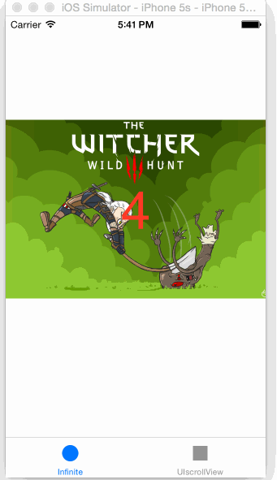
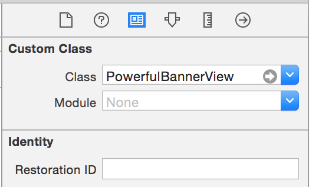

#PowerfulBannerView
UIScrollView实现的支持循环滑动的bannerView



#安装
* Cocoapods
```
pod 'SAInfiniteScrollView', '~> 1.0.4'
```

* 拷贝目录PowerfulBannerView，添加至工程即可

#如何使用
####创建对象
* nib加载


* 代码创建
```objc
CGRect screenBounds = [UIScreen mainScreen].bounds;
self.bannerView = [[PowerfulBannerView alloc] initWithFrame:CGRectMake(0, 200.f, CGRectGetWidth(screenBounds), 200.f)];
[self.view addSubview:self.bannerView];
```


####填充数据
1. 先配置一个block来创建内容，相当于UITableView的DataSource中得`cellForRowAtIndexPath:`
2. 塞入数据模型

这里以展示UIImageView为例：

```objc
// 内容配置block
self.bannerView.bannerItemConfigurationBlock = ^UIView *(PowerfulBannerView *banner, id item, UIView *reusableView) {
    
    // 这里可以尽可能重用视图
    UIImageView *view = (UIImageView *)reusableView;
    if (!view) {
        // 没有重用的，在这里创建一个
        view = [[UIImageView alloc] initWithFrame:CGRectZero];
        view.contentMode = UIViewContentModeScaleAspectFill;
        view.clipsToBounds = YES;
    }
    
    // 视图配置
    view.image = [UIImage imageNamed:(NSString *)item];
    
    return view;
};

// 设置内容的数据
self.bannerView.items = @[ @"1.jpg", @"2.jpg", @"ss-detail1.jpg", @"4.png", @"5.jpg", @"6.jpg" ];

```

####点击事件处理
配置block回调来处理点击事件
```objc
self.bannerView.bannerDidSelectBlock = ^(PowerfulBannerView *banner, NSInteger index) {
        printf("banner did select index at: %zd \n", index);
    };
```

####支持PageControl
对于PageControl的支持，可以是UIPageControl或者其他自定义的。但是需要包含如下两个属性
```objc
@property (nonatomic) NSInteger numberOfPages;
@property (nonatomic) NSInteger currentPage;
```

设置PageControl
```objc
self.bannerView.pageControl = pageControlInstance;
```


####配置滚动方式（按需配置）

* 开启循环滚动，并设置自动触发
```objc
// 配置循环滚动的时间间隔
self.bannerView.loopingInterval = 2.f;
// 开启自动循环滚动
self.bannerView.autoLooping = YES;
```

* 开启循环滚动，手动触发
```objc
// 配置循环滚动的时间间隔
self.bannerView.loopingInterval = 2.f;
// 关闭自动循环滚动
self.bannerView.autoLooping = NO;
```

* 关闭循环滚动（UIScrollView的style）
```objc
// 关闭循环滚动
self.bannerView.infiniteLooping = NO;
```

#License

MIT
